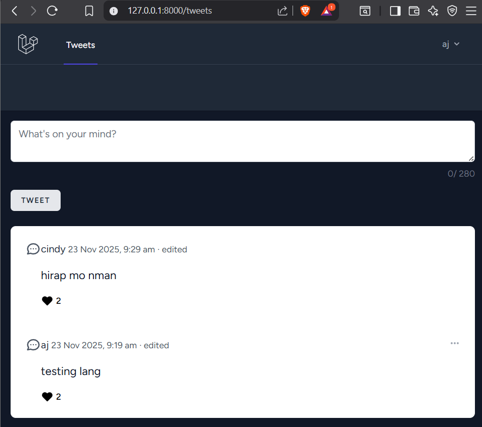
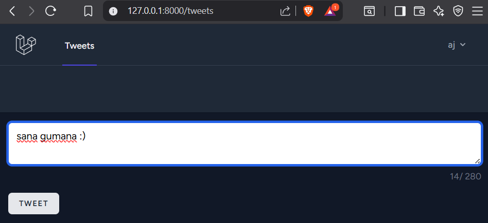
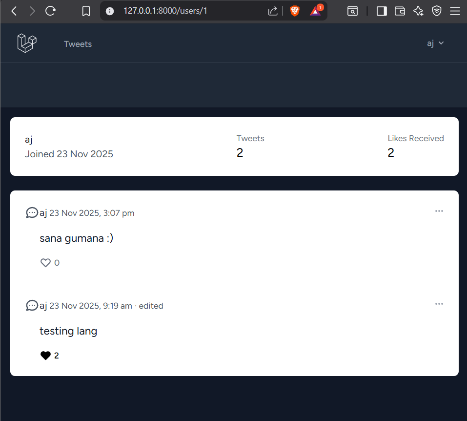
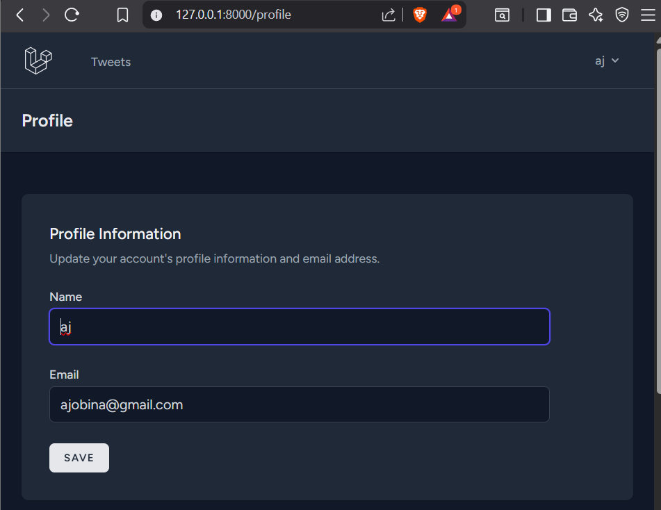
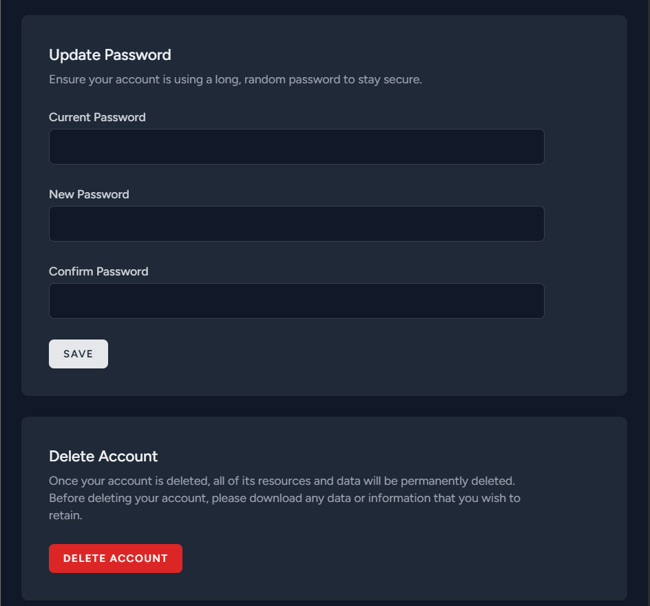

# Twitter-Like Social Media Application

## Project Description and Purpose
This project is a functional social media application built with **Laravel** and **MySQL**. It was developed as a requirement for the Laboratory Midterm Exam. The purpose of the application is to replicate core Twitter functionalities, allowing users to register, post short updates (tweets), interact via likes, and view user profiles. The application focuses on clean architecture, secure authentication, and a responsive user interface using **Tailwind CSS**.

## Features Implemented
### 1. User Authentication
* Secure registration, login, and logout using **Laravel Breeze**.
* Password hashing and protected routes (middleware).

### 2. Tweet Management
* **Create:** Users can post tweets with a strict 280-character limit (enforced via backend validation and frontend live counter).
* **Read:** Global timeline displays tweets from all users, ordered by newest first.
* **Update:** Users can edit their own tweets (shows an "edited" status).
* **Delete:** Users can delete their own tweets with a confirmation prompt.

### 3. Like System
* Users can like and unlike tweets.
* **AJAX/Alpine.js Integration:** Likes update instantly without a full page refresh.
* Visual indicators (heart turns red) and dynamic count display.
* Database constraints ensure a user can only like a tweet once.

### 4. User Profile
* Dedicated profile page for every user.
* Displays user stats: **Join Date**, **Total Tweets**, and **Total Likes Received**.
* Lists all tweets created by that specific user.

## Technical Stack
* **Framework:** Laravel (PHP)
* **Database:** MySQL
* **Frontend:** Blade Templates, Tailwind CSS, Alpine.js
* **Authentication:** Laravel Breeze

---

## Installation Instructions

## Follow these steps to set up the project locally:

## 1. Clone the Repository
* ```bash
* git clone <https://github.com/ceto-31/twitter_v2.git>
* cd twitter-clone

## 2. Install Dependencies
* Install PHP and JavaScript dependencies:

* Bash
*    composer install
*    npm install

## 3. Environment Setup
* Copy the example environment file and generate the application key:

* Bash
*    cp .env.example .env
*    php artisan key:generate

## 4. Database Setup Steps
*    a. Create a MySQL database named twitter_clone using MySql

*    b. Open the .env file in the project root and update your database credentials:

*    Code snippet

*   **DB_CONNECTION=mysql**
*   **DB_HOST=127.0.0.1**
*   **DB_PORT=3306**
*   **DB_DATABASE=twitter_clone**
*   **DB_USERNAME=root**
*   **DB_PASSWORD=**

*    c.Run the database migrations to create the tables:

*    Bash
*        php artisan migrate

## 5. Build Frontend Assets
* Compile the Tailwind CSS and JavaScript assets:

*    Bash
*    npm run build

## 6. Run the Application
* Start the local development server:

 *   Bash
 *   php artisan serve

*    Access the app at: http://127.0.0.1:8000

## Screenshots of the Application
* 1. Global Timeline (Dashboard)
    
    
* 2. Display User Stats
    
* 3. User Profile
    
    

## App Deployment ##
* **Live URL: []**

* **Hosting Platform: Laravel Cloud**

## Credits
This project was developed with the assistance of **Google Gemini**.
* Google Gemini provided step-by-step guidance for project setup, generated code for core features (Tweets, Likes via Alpine.js, User Profiles), debugged database and routing errors, and assisted with documentation.